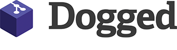

# 

[Dogged](https://github.com/ethomson/dogged) is a .NET wrapper around
[libgit2](https://github.com/libgit2/libgit2).  It was inspired by the
[LibGit2Sharp](https://github.com/libgit2/libgit2sharp) project.

## API Reference

Dogged consists of two different projects that you can use to manage Git
repositories.

#### [Dogged](dogged/Dogged.html)

The Dogged project is a set of high-level APIs for working with Git
repositories from .NET.  These are the APIs that are recommended for all
users.

#### [Dogged.Native](dogged.native/Dogged.Native.html)

The Dogged.Native project is a set of low-level PInvoke APIs that act as
bindings for the [libgit2 project](https://libgit2.org/).  These APIs are
used internally by Dogged, but are also provided for consumers who need to
use low-level APIs.

## Contribute

Dogged is developed [on GitHub](https://github.com/ethomson/dogged).

Dogged is available under the MIT license, see the included file
[`LICENSE`](https://raw.githubusercontent.com/ethomson/dogged/main/LICENSE)
for details.
